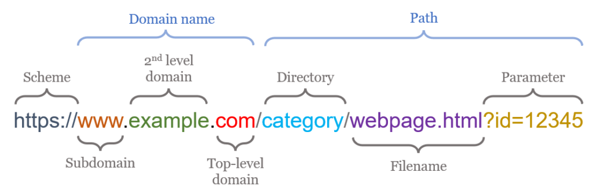
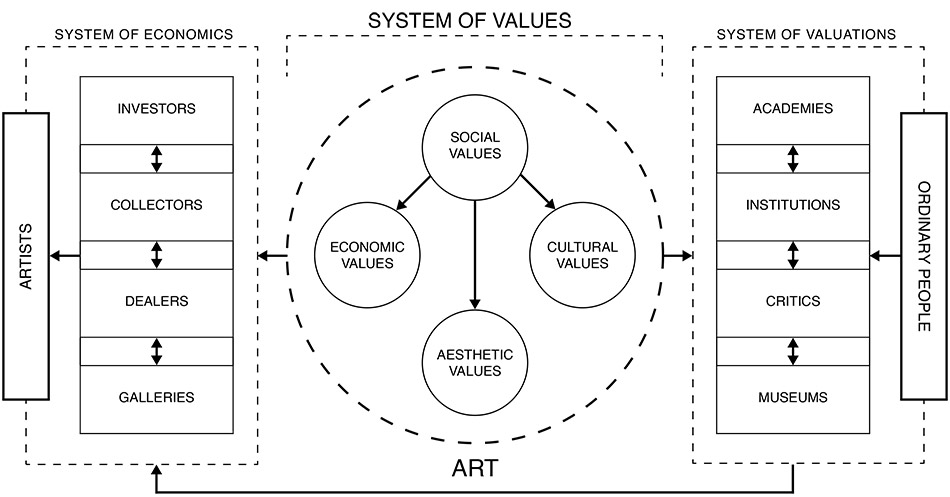
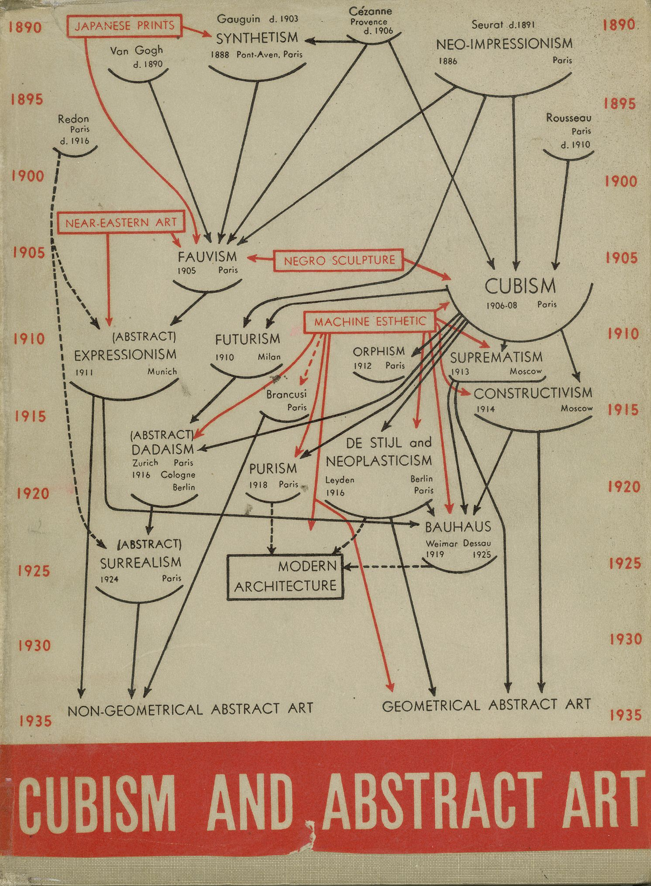
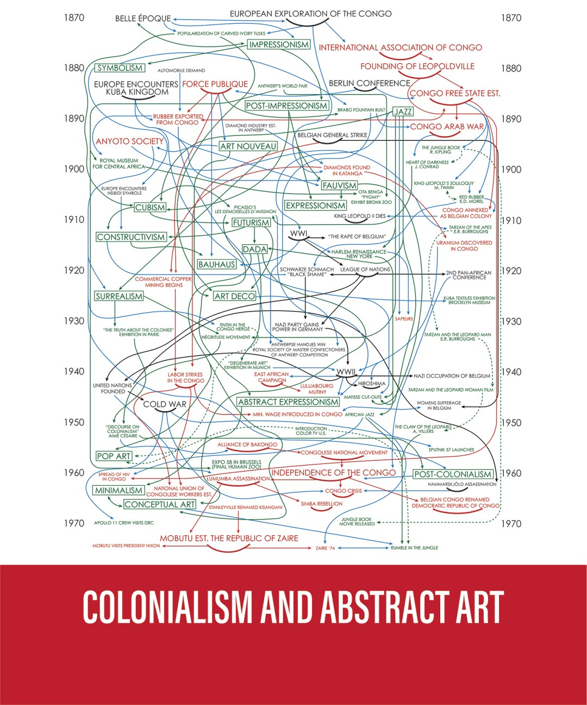
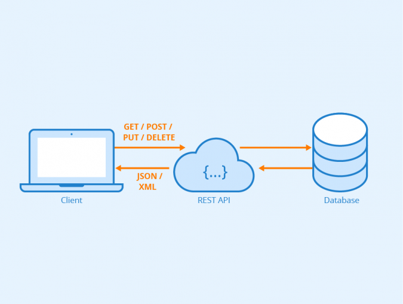

# Critical Data Overloads: Acquisition

---

## Plan for the day

---

This morning:

- discussing scrapism
- identifying a corpus
- exchanging ideas and forming groups

---

This afternoon:

- Python recap
- interfacing with an API
- other tools and techniques for data collection
- discussing corpus ideas and tactics

---

## Scrapism: A Manifesto

---

What did you think of [the reading](lav.io/media/scrapism.pdf)?

What kind of scrapism resonates

- political intervention
- public archive
- activated archive?

---

What about the grey legal areas?

Does data, or the web, obey different economic laws?

---

> Art is a breach in the system[^vera]

[^vera]: Vera Molnar

<!-- 

Where does the data come from, how do systems communicate with one another?

The machine exchange of data, back to Shannon

-->

---

The web is a database

- servers (as in storage)
- servers (as in control)
- URLs and query parameters



<!--

maybe discussing a bit more how the web works, what is a URL, what is a server

-->

---

Understanding systems by looking in their databases.

How you classify things classifies you[^bourdieu][^miller], and what is made visible is made political[^ranciere]

[^bourdieu]: Bourdieu, P. (1970) _Distinction: A Social Critique of the Judgment of Taste_.
[^miller]: Miller, D., (2002) _Artefacts or the meaning of things_.
[^ranciere]: Rancière, J., (2000) _Le partage du sensible_.

<!--

The filings and the documents by economical and governmental organizations provide a lot of insight

How you classify things reveal things about you (miller, artefacts). Taste in spotify is kinda machine-generated

-->

---

The web as a bureaucracy:

from machine __into__ the machine.

<!-- 

Machine in the Kafka sense of the term.

The mechanical processing of standardized inputs.

What kinds of machines can we think of?

School, hospital, military, entertainment.

-->

---

The web as an artwork:

from machine __out of__ the machine.

<!--

By re-contextualizing, you give a different interpretation, a different light on the same data.

-->

---

## Identifying a corpus

---

Turning a dataset into a __corpus__.

The purpose of a corpus is to learn something from it, and to communicate these findings to others.

<!--

A corpus is something that can be studied, that has an interest in terms of research. It means we can learn things from it.

But what things?

First, what are the kinds of things to consider when imagining a corpus?

-->

---

__Intra__-textuality is the comparison of different parts of the same text, and allows to reveal repeating patterns.

---

It can highlight some broad themes, blurry but evocative

"I am 20 years old and..."

[r/googlepoems](https://www.reddit.com/r/googlepoems/)

---

It can highlight some structures.



---

__Inter__-textuality is the comparison of parts of different texts, showing how they are connected.





---

__Inter__-textuality also recreates networks of dependencies.

(Google Analytics, WordPress)

---

A comparative approach puts the focus on __what is different__ and __what is the same__.

---

Finding a topic:

- What __culture__ do you want to explore?
- What __system__ do you want to reveal?
- What __themes__ do you want to address?

<!--

Culture is about the imaginaries, the practices, the common beliefs that link us together. How people express themselves, e.g.

System is about the invisible connections and arrangements that are fixed in place in order to achieve something.

10 minutes to write down 4-5 of them

-->

---

Creative constraints:

- It should not already exist (but you can use existing datasets).
- It should be large (> 500) (a change in quantity can become a change in quality).

<!-- Take the rest of the morning to start googling around -->

Presenting our ideas (Miro board)

---

Finding the data:

- How does this data manifest itself on the web?
- Who __produces__ this data? What are the organizations that circulate this data? What are the organizations who __use__ this data?
- Is it on a webpage? on an app? served over an API? Do you have to cross-reference multiple sources to find it?

---

MAHLZEIT (think about it over lunch)

---

## Groups

- julian, simon
- feng, lena
- johanna, tillman, soo
- marc, finn
- denise, kristian, tim
- eunsong, shin

---

## Python recap

---

Moving around in the terminal/command prompt/command line

---

Four basics of programming

---

1. variables
2. functions
3. loops
4. conditional statements

---

## Working with an API

---

The overal model:

You < API > Data



---

Moving parts:

- the data models
- the access key

---

Data __structures__

`JSON` is the default way of exchanging information on the web.

```js
{
    "key": "value",
    "key2": [
        "value1",
        "value2"
    ],
    "key3": {
        "key4": "value3",
        "key5": [
            "value4",
            "value5"
        ]
    }
}
```

---

The data model is how the data is represented by a specific organization.

For instance, [YouTube](https://developers.google.com/youtube/v3/docs/videos), [SoundCloud](https://developers.soundcloud.com/docs/api/explorer/open-api#/tracks/get_tracks__track_id_) and [Spotify](https://developer.spotify.com/documentation/web-api/reference/get-track) represent a song in different ways.

---

The access key is a unique identifier that protects the organization from abuse.

You can either __apply for one__ or __borrow one__.

---

__Example__: getting all stock images used to illustrate a tech website.

---

__Example__: getting all tracks on soundcloud that have less than 5 plays.

1. examining the soundcloud model
2. borrowing a key
3. requesting a track
4. starting somewhere

---

## Strategies and tactics

---

Group work to figure out how exactly you're going to get this data:

- what are the sources? how accessible are they? are there __proxies__? is there anything missing from them?
- what are the data models? what are the markups?
- what are the most appropriate tools to tackle the issue? are there any obvious problems that need to be solved?

Test early, fail early, solve early!

---

Tools:

- existing datasets
- browser orchestration
- ready-made systems (minet)

---

## Homework

- __consider__ consulting Pierre over the weekend for conceptual and technical issues (room 320).
- __collect__ your corpus, and come ready to present it to your classmates.
