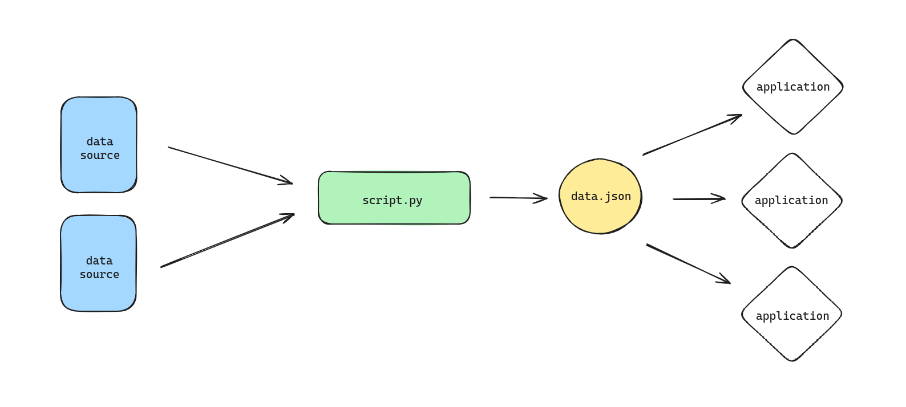

# Critical Data Overload: Restitutions

---

## Plan for the day

---

This morning:

- cleaning and formatting data
- modes of representation
- work session

---

This afternoon:

- work session
- presentation of corpus

---

## Cleaning and formatting data

---

Cleaning data and formatting data is essential for __sustainability__.

---



---

Cleaning involves:

- removing __duplicates__
- removing __incomplete__
- removing __extra whitespace__
- force __datatypes__
- standardize __formats__

---

Formatting involves:

- choosing a storage format (CSV, JSON, XML)
- consolidating into one file if possible
- naming files properly (e.g. `YYYY-MM-DD_HH-MM-SS_{name-of-data}_{random-number}.{format}`) (avoids overwrites! helps finding data!)

---

CSV (_comma-separated value_) is the file format of Excel, very popular, not very expressive

```csv
name,location,date
'paris,texas',us,1984
ikiru,jp,1952
mauvais sang,fr,1986
parasite,kr,2019
```

---

```py
import csv

films = [
    {
        'name': 'paris, texas',
        'location': 'us',
        'date': 1984
    },
    {
        'name': 'ikiru',
        'location': 'jp',
        'date': 1952
    },
    {
        'name': 'mauvais sang',
        'location': 'fr',
        'date': 1986
    },
    {
        'name': 'parasite',
        'location': 'kr',
        'date': 2019
    },
]

with open('data.csv', 'w', newline='') as csvfile:
    fieldnames = ['name', 'location', 'date']
    writer = csv.DictWriter(films, fieldnames=fieldnames)
    writer.writeheader()
    writer.writerows(data)
```

---

JSON is more expressive than CSV, but a bit more complicated

```py
import json

data = {
    #...
}

with open('data.json', 'w') as jsonfile:
    json.dump(data, jsonfile)
```

---

## Modes of representation

---

We have data. Now what?

---

__Representation__ shapes data to _express_ something.

- What do we want to say?
- How do we say it best?
- What kind media? What kind of context?

---

__Transmedia__ to reveal patterns in an engaging way.

- sound, space: [Two Trains](https://datadrivendj.com/tracks/subway/)
- sound, space, time: [airpressure](https://www.airpressure.info)

---

__Zoomed out__ to reveal the sheer size of smaller, repeating elements

- on a plane ([hhellbbllaauu](https://hhellblauu.tumblr.com))
- in a space ([embedding projector](https://projector.tensorflow.org))
- on a track ([quotidian record](https://brianhouse.net/works/quotidian_record/))

---

__Zoomed in__ to focus on each piece of data, with the quantity as a background

- on a plane ([wonders of street view](https://neal.fun/wonders-of-street-view/), [mturk poems](https://www.instagram.com/mturkpoems/))
- in space ([astronaut.io](http://astronaut.io))

---

Focusing on the __mass__ or on the __sample__?

Giving a lot of context, a little context, or a whole new context?

Is it more of a document, or a performance?

Is it a restitution, or an interpretation?

---

## Work session

---

- finish gathering your data
- finish cleaning your data
- write some notes about what you did, how you did it, and why
- think about some ideas for representing the data

---

## Presentations

- Helin is joining ✨
- For each group, connect to Zoom and share screen (link in Discord)

Questions:

- What data did you gather? Why?
- How did the gathering go? What did you use and what were some obstacles?
- How do you imagine using this data afterwards?
